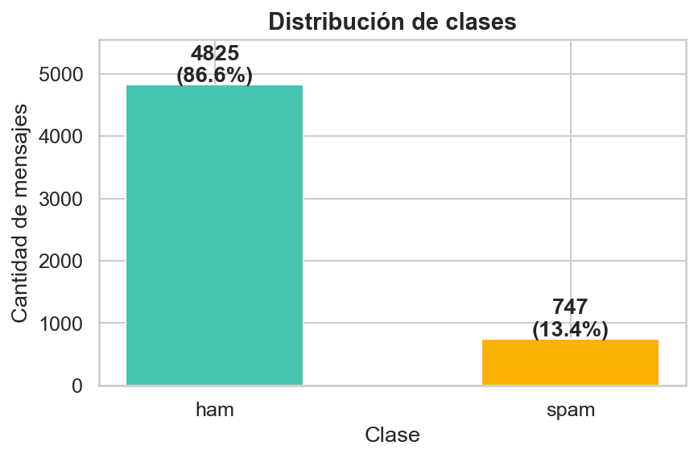
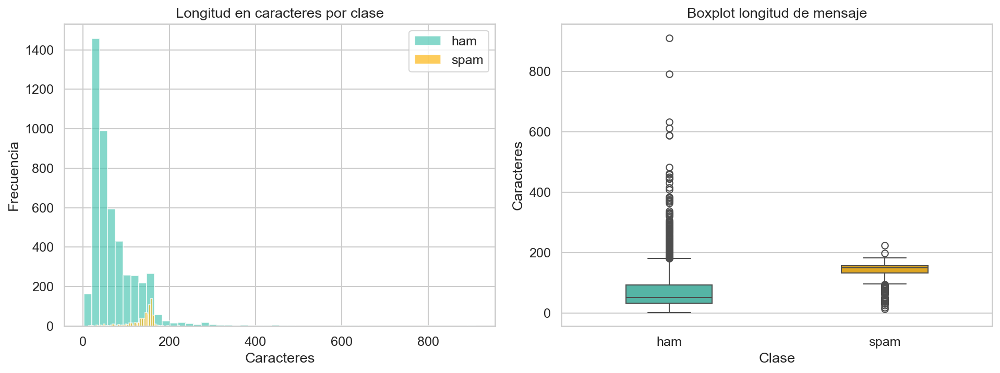
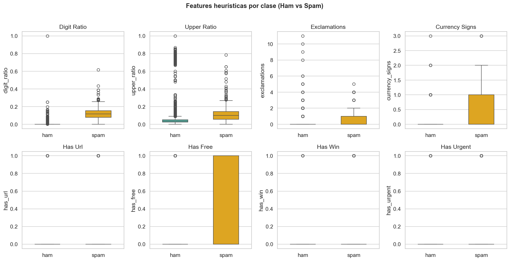
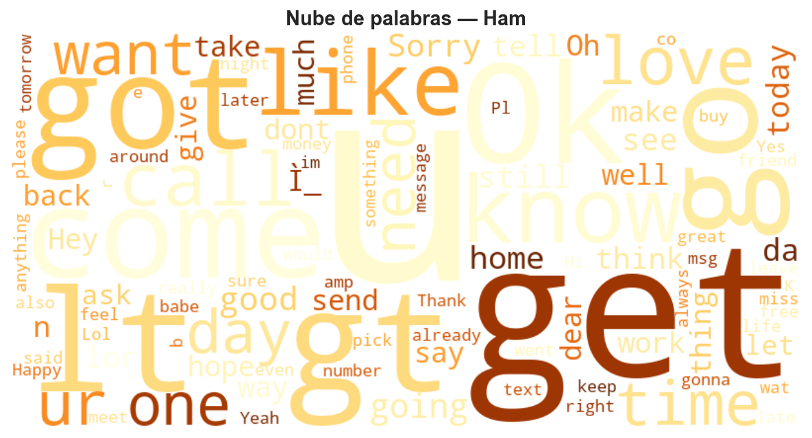
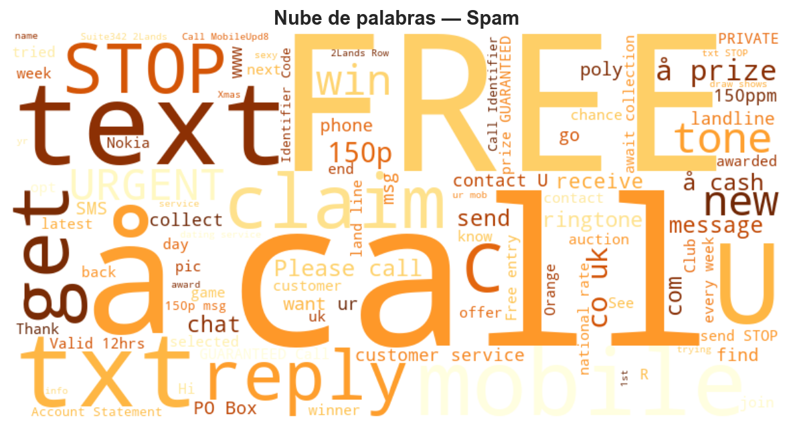
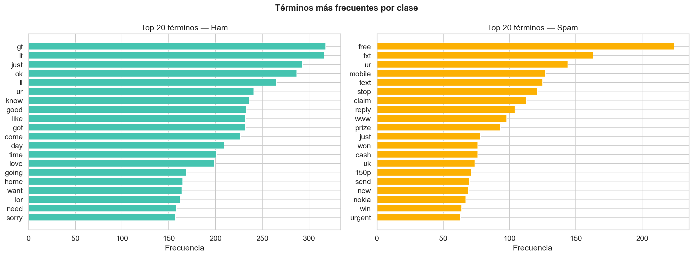
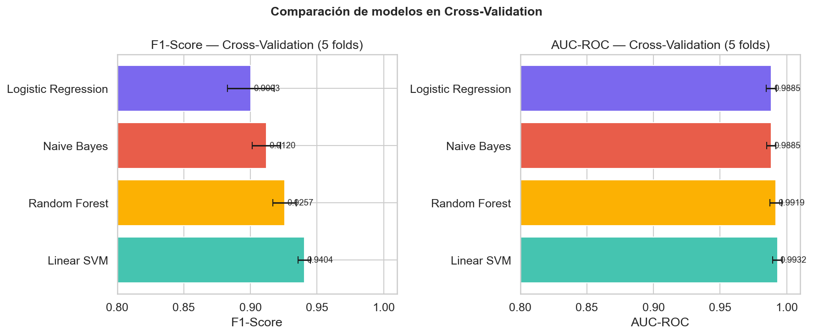
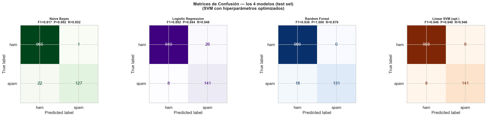
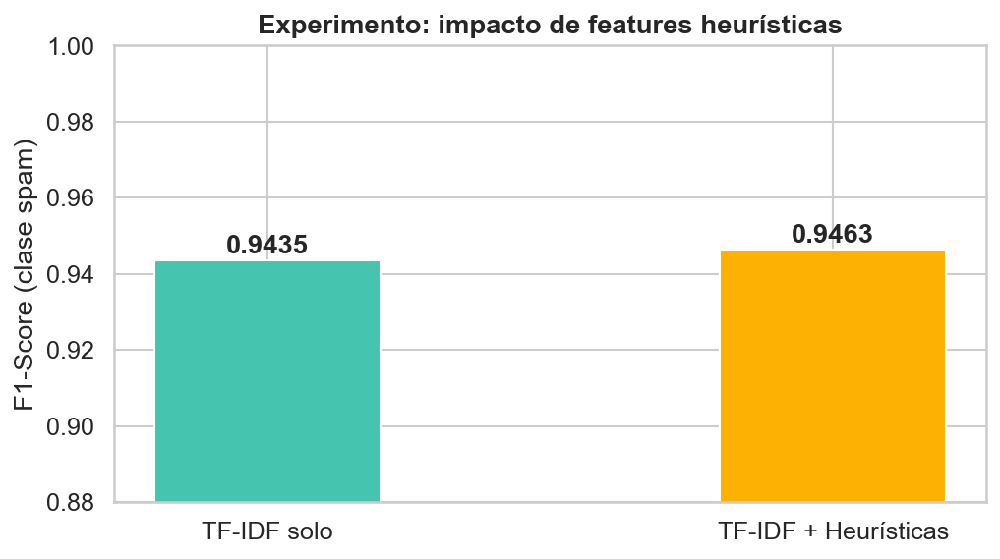

# Deteccion de spam en SMS

Proyecto final de **Algoritmos Avanzados** para clasificar mensajes SMS como
`ham` (mensaje legitimo) o `spam`.

## Descripcion

El proyecto analiza el conjunto de datos `spam.csv`, realiza un analisis
exploratorio y entrena modelos de aprendizaje automatico para detectar spam.
El flujo principal incluye:

- Analisis de la distribucion de clases y de la longitud de los mensajes.
- Limpieza conservadora del texto: minusculas, sustitucion de URLs y numeros,
	eliminacion de stopwords y stemming.
- Representacion de los mensajes mediante TF-IDF con unigramas y bigramas.
- Validacion cruzada estratificada de 5 particiones dentro de un `Pipeline`,
	evitando fuga de informacion (*data leakage*).
- Comparacion de Naive Bayes, Regresion Logistica, Linear SVM y Random Forest.
- Busqueda de hiperparametros del Linear SVM mediante `GridSearchCV`.
- Evaluacion en un conjunto de prueba independiente, matriz de confusion y
	analisis de falsos positivos y falsos negativos.
- Experimento comparativo entre TF-IDF solo y TF-IDF mas 8 caracteristicas
	heuristicas del mensaje.

## Datos y resultados

El dataset contiene **5,572 mensajes**:

- 4,825 mensajes `ham` (86.6%).
- 747 mensajes `spam` (13.4%).

El mejor resultado corresponde al Linear SVM optimizado con `C=5.0` y un
maximo de 3,000 caracteristicas TF-IDF:

| Metrica | Resultado |
| --- | ---: |
| F1 de spam en validacion cruzada | 0.9455 |
| Precision de spam en test | 0.9463 |
| Recall de spam en test | 0.9463 |
| F1 de spam en test | 0.9463 |
| Accuracy en test | 0.9857 |
| AUC-ROC en test | 0.9938 |
| Falsos positivos | 8 |
| Falsos negativos | 8 |

En el experimento de representaciones, agregar las 8 caracteristicas
heuristicas mejora el F1 de test de **0.9435** a **0.9463**, una diferencia de
`+0.0028`.

## Graficas

Las graficas se generan automaticamente en la carpeta [`plots/`](plots/).

### Distribucion y longitud de los mensajes





### Caracteristicas y terminos relevantes









### Evaluacion de modelos








## Ejecucion

Instalar las dependencias principales:

```bash
pip install pandas numpy matplotlib seaborn nltk wordcloud scipy scikit-learn
```

Ejecutar el script desde la raiz del proyecto:

```bash
python spam_detection.py
```

El programa descarga las stopwords de NLTK si es necesario, muestra los
resultados en la terminal y actualiza las imagenes dentro de `plots/`.

## Consideraciones

El script no aplica PCA: la matriz TF-IDF es dispersa y mantenerla en ese
formato conserva mejor la interpretabilidad de los terminos. El desbalance de
clases se considera mediante particiones estratificadas y `class_weight` en
los modelos que lo soportan.
